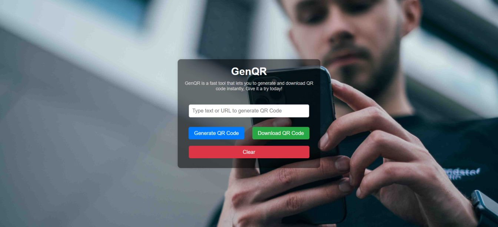

# GenQR

GenQR is a simple, fast and user-friendly QR code generator that allows you to **generate, download and reset** QR codes instantly. Whether you need a QR code for a website, text or other content, GenQR makes it quick and easy!

## 💻 Demo Screenshot



## 🔗 Live Demo

Check out the app live here: **[GenQR](https://premkrrajbhar.github.io/GenQR/)**

## 🔥 Features

- 📌 **Generate QR Codes** from any text or URL.
- 💾 **Download QR Codes** as an image file.
- 🔄 **Reset QR Code** instantly to create a new one.
- 🎨 **Clean and responsive UI** for a seamless experience.
- ⚡ **Fast and lightweight** no extra dependencies needed.

## 🛠️ Technologies Used

- **HTML** – Structure of the web page.
- **CSS** – Styling for a modern UI.
- **JavaScript** – Logic for generating and downloading QR codes.
- **QRCode.js** – JavaScript library for QR code generation.

## 🎯 How to Use

- Step1: **Enter Text or URL** – Type the text/URL in the input field.
- Step2: **Click 'Generate QR Code'** – The QR code will appear instantly.
- Step3: **Download the QR Code** – Click the 'Download' button to save it.
- Step4: **Reset if Needed** – Click 'Clear' to reset and generate a new QR code.

## 📂 Project Structure

```
├── README.md
├── assets/
│   ├── backgroundImage/
│   │   └── bg-img.jpg
│   ├── favicon/
│   │   └── genqr-favicon.png
│   └── screenshot/
│       └── screenshot.jpg
├── css/
│   └── style.css
├── index.html
└── script/
    └── script.js
    
```

## 📥 How to Run Locally

- Step 1: Clone the repository:

```bash
   git clone https://github.com/premkrrajbhar/GenQR.git
```

- Step 2: Navigate to the project folder:

```bash
   cd GenQR
```

- Step 3: Open the `index.html` file in your web browser to start using the app.

## 🤝 Contributing

Contributions are welcome! If you have suggestions or improvements, feel free to submit a pull request or open an issue.

## 📞 Contact

For any questions or feedback, please reach out to:

- **Email**: [premkumar224487@gmail.com](mailto:premkumar224487@gmail.com)
- **GitHub**: [premkrrajbhar](https://github.com/premkrrajbhar)
